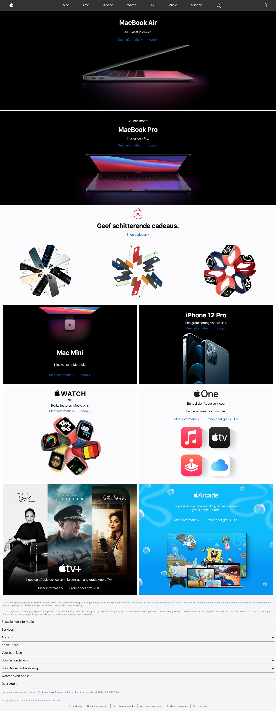
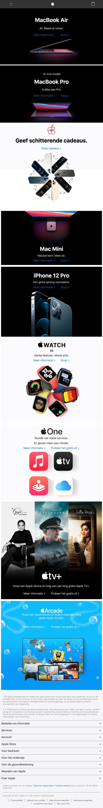
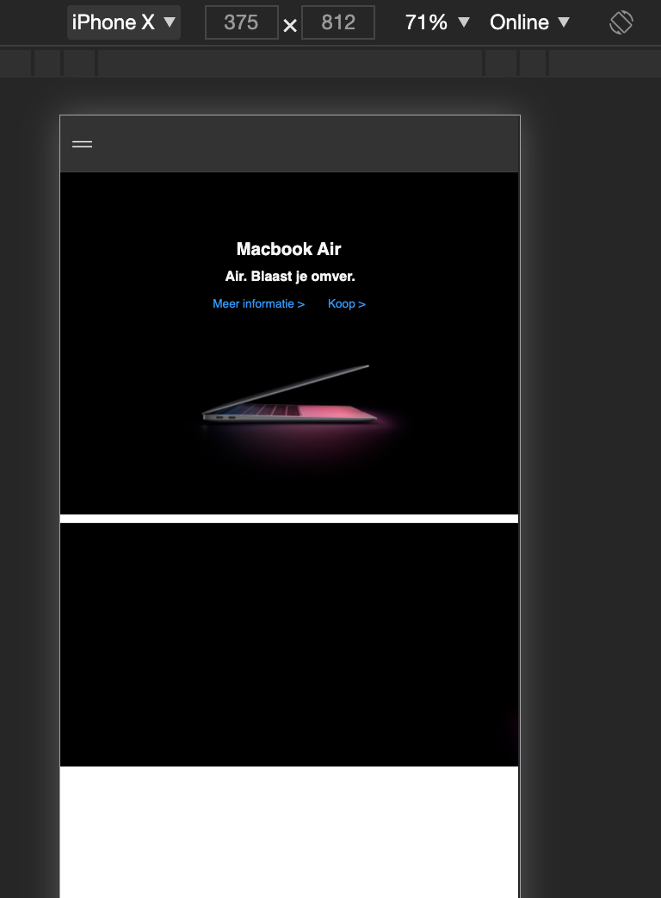

# Procesverslag Frontend Development
Auteur: Ellen Bloemhof
500823683
Klas 202

## Bronnenlijst
<b>1. Mogelijkheid voor het toevoegen van een favicon, w3schools:</b>
https://www.w3schools.com/tags/att_link_sizes.asp

Op internet opgezocht hoe je een afbeelding in het tabblad plaatst, zodat er niet alleen "Apple" zou staan maar ook het logo.

<b>2. Geanimeerd hamburgermenu, Sanne 't Hooft:</b>
https://codepen.io/shooft/pen/jOMOroZ

Voorbeeld van Sanne gebruikt om zelf een geanimeerde button te maken voor het hamburgermenu, deze zo aangepast dat het past bij de huisstijl van Apple.

<b>3. Responsive navigatie, Sanne 't Hooft:</b>
https://codepen.io/shooft/pen/BaKGKwm

Oefening van Sanne gebruikt om zelf een responsive navigatie te maken, deze zo aangepast dat het past bij de huisstijl van Apple.

<b>4. Detail tag, MDN Web Docs:</b>
https://developer.mozilla.org/en-US/docs/Web/HTML/Element/details

Detail tag gebruikt op de footer, wist niet hoe ik deze kon vormgeven dus hierover informatie opgezocht.

## Toegankelijkheid
Tijdens het spelen met de voiceover op mijn webpagina kwam ik erachter dat links zoals "meer informatie >" niet op de juiste manier staan vermeld. Het ">"-teken had ik beter kunnen vormgeven in plaats van in de tekst omdat deze natuurlijk ook wordt opgelezen voor de gebruiker.

Echter weet ik helaas niet hoe ik dit zou oplossen en daarom heb ik het zo gelaten.

Verder is het mogelijk voor de gebruiker om volledig zonder muis te navigeren door de websites en onderdelen te openen.

## Eindgesprek (week 7/8)

-dit ging goed & dit was lastig-
Iets wat goed ging maar wat ik ondertussen nog wel erg lastig vind is grid. Ik heb grid nu aardig onder de knie, het is mij gelukt om elementen daarmee te positioneren. Echter blijf ik het nog wel lastig te vinden om toe te passen, ik had voor mijzelf een cheatsheet gemaakt in Codepen die ik iedere keer erbij kon pakken, daar binnen onderdelen kon uit proberen en vanuit daar verplaatsen naar mijn eigen site.

Maar ik ben zeker wel erg enthousiast over wat ik gemaakt heb, voordat dit vak begon kon ik mij niet voorstellen dat ik dit zelf zou kunnen maken.

**Screenshot homepagina:**

## Voortgang 3 (week 6)
Bespreken:
- text-decoration werkt niet;
- footer: is dat hetzelfde als een hamburger menu?
- Blok 6: Apple one > P's moeten onder elkaar, is de manier van stylen goed toegepast?

Advies van Vasilis om mij te verdiepen in display flex of grid om elementen te positioneren. Ik had dit toegepast doormiddel van relative en absolute maar hij gaf aan dat het niet de juiste manier is om een layout te maken.

Voor de footer kreeg ik de tip om te kijken naar de details tag om deze toe te passen op de mobiele versie.

## Voortgang 2 (week 5)

Aangegeven dat ik achter loop, ik moet aankomende week een flinke inhaalslag gaan maken anders haal ik de beoordeling niet - aangegeven dat ik al een planning voor mijzelf had gemaakt dus dit moet goedkomen. Liep vast met een probleem met de afbeelding, kreeg het advies dat bijsnijden van de afbeelding ook geen probleem is. Verder teveel gebruik gemaakt van div-jes deze vervangen met sections/articles, daar ook verdere uitleg over gevraagd.

### Agenda voor meeting
background-image > cover. Hoe zorg ik ervoor dat ik de afbeelding kan verplaatsen zoals ik wil? Hij zit nog steeds vast aan de linkerzijde en ik krijg ‘m niet in het midden.

Z-index, wat zijn logische waarden daarvoor?

## Voortgang 1 (week 3)

### Stand van zaken
Door een tutorial op YouTube heb ik een responsive navigatie kunnen bouwen, veel tijd ingestoken en ook erg enthousiast over. Verder een kleine start kunnen maken door de eerste twee blokken van de homepage kunnen bouwen. Ik loop er nu tegen aan hoe ik moet positioneren met afbeeldingen omdat veel witruimte van de afbeelding wordt gebruikt voor tekst.

**Screenshot(s):**

### Agenda voor meeting

-samen met je groepje opstellen-

| Ellen          | Jasmijn            | Amy          | Beyza            |
| ---            | ---                | ---          | ---              |
| Wanneer pas je welke heading toe?   | Problemen met flexbox            | Hoe maak je een hamburger menu?    | Hoe pas je text-shadow toe? |
| Hoe kader ik een afbeelding? | Problemen met video | Hoe maak je een goede slider? | transform: skewY alleen op de tekst krijgen |
| Wat is beter? Div’s/class/ID?           | Mag de NAV later worden toegepast? | Responsive          | ...              |

### Verslag van meeting

Meeting was nuttig! Samen met mijn groepje via Google docs een document opgestelt met alle vragen die wij hadden. Ik liep vast met de afbeeldingen op mijn website, advies gekregen om mij te verdiepen in 'background-size: cover'.

Verder advies gekregen over het gebruik van pixels en em. En toelichting over vw-min en vw-max.

Ik had zelf nog moeite met headings niveau's, ik wist niet op welk moment ik welke moet toepassen. Hier ook nog uitleg over verkregen en notities gemaakt.

## Breakdownschets (week 1)

## Intake (week 1)
**Mijn startniveau:** blauwe piste, maar stiekem bedolven onder de sneeuw. Tech onderdelen blijf ik erg moeilijk vinden, echter ben ik wel heel enthousiast wanneer het mij lukt. Ik weet van mijzelf dat ik hier meer tijd aan moet besteden en op tijd hulp moet vragen.

**Je focus:** Responsive is iets wat ik HEEL ERG GRAAG onder de knie wil krijgen.

**Je opdracht:** https://www.apple.com/nl/

**Screenshot(s) van de eerste pagina (small screen):**

**Screenshot(s) van de tweede pagina (small screen):**
Link naar tweede pagina: https://www.apple.com/nl/shop/iphone/iphone-accessories

