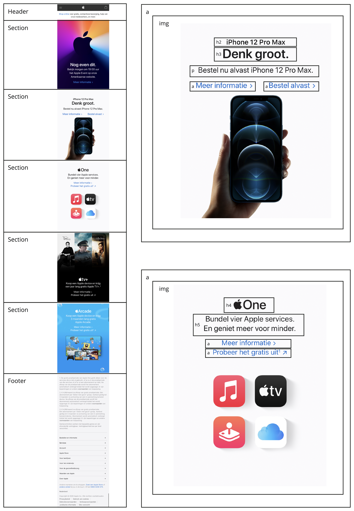
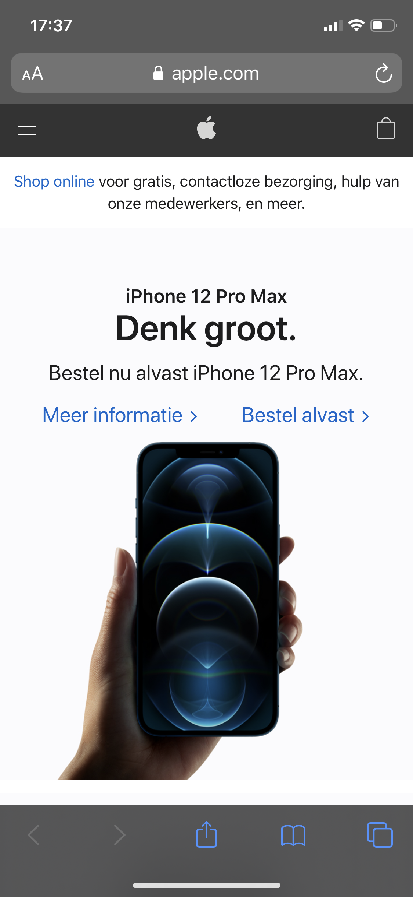
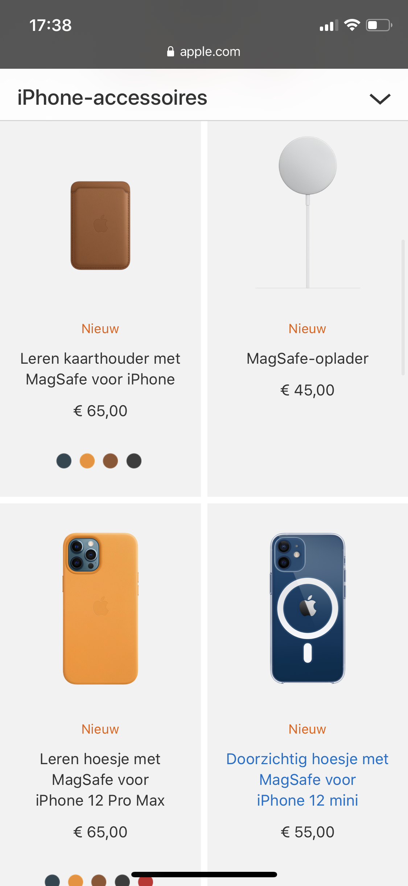

# Procesverslag Frontend Development
Auteur: Ellen Bloemhof

Markdown cheat cheet: [Hulp bij het schrijven van Markdown](https://github.com/adam-p/markdown-here/wiki/Markdown-Cheatsheet). Nb. de standaardstructuur en de spartaanse opmaak zijn helemaal prima. Het gaat om de inhoud van je procesverslag. Besteedt de tijd voor pracht en praal aan je website.

## Bronnenlijst
1. -bron 1-
2. -bron 2-
3. -...-

## Eindgesprek (week 7/8)

-dit ging goed & dit was lastig-

**Screenshot(s):**

-screenshot(s) van je eindresultaat-

## Voortgang 3 (week 6)

-same as voortgang 1-

## Voortgang 2 (week 5)

-same as voortgang 1-

## Voortgang 1 (week 3)

### Stand van zaken

-dit ging goed & dit was lastig-

**Screenshot(s):**

-screenshot(s) van hoe ver je bent met korte uitleg-

### Agenda voor meeting

-samen met je groepje opstellen-

| Ellen          | Jasmijn            | Amy          | Beyza            |
| ---            | ---                | ---          | ---              |
| Wanneer pas je welke heading toe?   | Problemen met flexbox            | Hoe maak je een hamburger menu?    | Hoe pas je text-shadow toe? |
| Hoe kader ik een afbeelding? | Problemen met video | Hoe maak je een goede slider? | transform: skewY alleen op de tekst krijgen |
| Wat is beter? Div’s/class/ID?           | Mag de NAV later worden toegepast? | Responsive          | ...              |

### Verslag van meeting

-na afloop snel uitkomsten vastleggen-

## Breakdownschets (week 1)

## Intake (week 1)
**Mijn startniveau:** blauwe piste. Tech onderdelen blijf ik erg moeilijk vinden, echter ben ik wel heel enthousiast wanneer het mij lukt. Ik weet van mijzelf dat ik hier meer tijd aan moet besteden en op tijd hulp moet vragen.

**Je focus:** Responsive is iets wat ik HEEL ERG GRAAG onder de knie wil krijgen.

**Je opdracht:** https://www.apple.com/nl/

**Screenshot(s) van de eerste pagina (small screen):**

**Screenshot(s) van de tweede pagina (small screen):**
Link naar tweede pagina: https://www.apple.com/nl/shop/iphone/iphone-accessories

